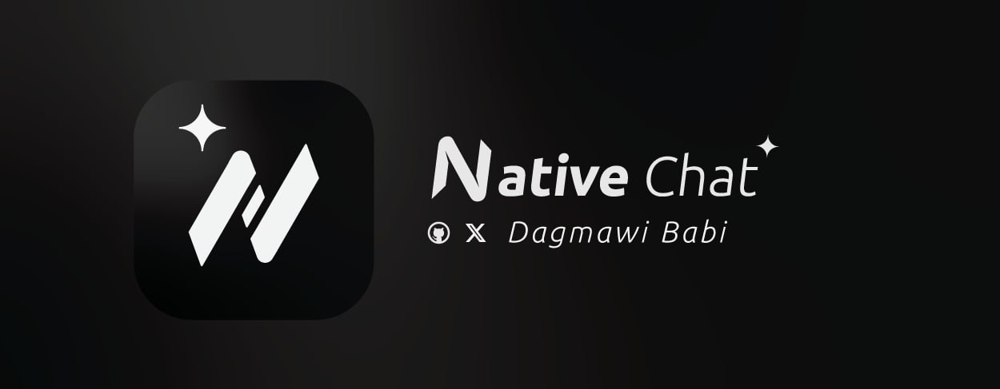
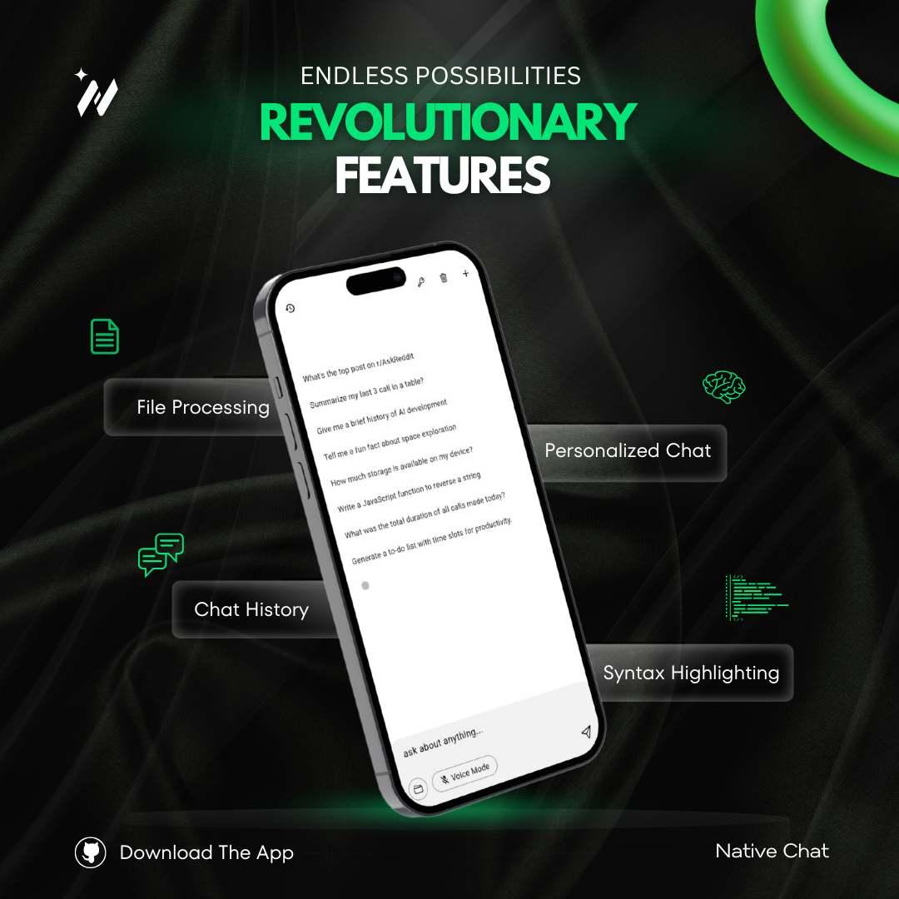
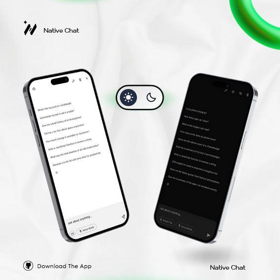

# 🤖 NativeChat - Advanced AI Assistant

**Version 1.8.0** | **Production Ready** ✅

NativeChat is a cutting-edge AI-powered mobile assistant that provides context-aware interactions directly on your Android device. Built with Flutter and supporting multiple AI providers, it offers real-time device integration, multimodal capabilities, and advanced conversational AI features.

## 🚀 Key Features

### 🧠 **Multi-AI Provider Support**
- **Gemini 2.0 Flash** - Google's latest multimodal AI (Primary)
- **OpenAI GPT-4o/4o-mini** - Advanced conversational AI
- **Claude 4 Sonnet & 3.5 Sonnet** - Anthropic's capable models
- **Groq (FREE)** - Ultra-fast Llama 3 70B & Mixtral 8x7B
- **Hugging Face (FREE)** - CodeLlama 34B & Mistral 7B
- **OpenRouter** - Access to multiple premium models
- **Together AI (FREE)** - Llama 2 70B with free tier
- **Replicate** - Various open-source models

### 🎤 **Voice & Audio Features**
- **Voice Mode**: Complete hands-free interaction with speech-to-text and text-to-speech
- **Audio File Processing**: Upload and analyze MP3/M4A audio files
- **Real-time Voice Recognition**: Continuous listening and response

### 📱 **Device Integration & Context Awareness**
- **System Specifications**: CPU, RAM, storage, OS details
- **Call Log Analysis**: Incoming, outgoing, missed calls with statistics
- **SMS Processing**: Read, analyze, and summarize text messages
- **Battery Monitoring**: Real-time battery level and charging status
- **Installed Apps**: Complete app inventory with versions and install dates
- **Network Information**: WiFi details, IP addresses, connection status
- **Location Services**: GPS coordinates and address resolution

### 🌐 **Internet & API Integration**
- **Reddit Integration**: Live content from 100+ subreddits
- **News Aggregation**: Automatic news fetching from multiple sources
- **Web Content Processing**: URL analysis and content extraction

### 🖼️ **Multimodal Capabilities**
- **Image Processing**: Upload photos from gallery or capture with camera
- **File Attachments**: Support for documents, PDFs, text files
- **Visual Analysis**: AI-powered image understanding and analysis
- **Document Processing**: Read and analyze various file formats

### 🧠 **Memory & Personalization**
- **AI Memory System**: Remember user preferences and past conversations
- **Chat History**: Persistent conversation storage
- **Context Retention**: Maintain conversation context across sessions
- **Personalized Responses**: Adaptive communication based on user patterns

### 🎨 **User Interface & Experience**
- **Dark/Light Themes**: Automatic theme switching with AI commands
- **Chat Modes**: One-sided or bubble chat layouts
- **File Sharing Integration**: Receive shared content from other apps
- **Animated UI**: Smooth transitions and loading animations
- **Code Highlighting**: Syntax highlighting for multiple programming languages

## 🔧 Advanced AI Functions

### 📊 **Device Analytics**
```dart
- getDeviceTime(): Current date, time, timezone
- getDeviceSpecs(): CPU, RAM, storage, OS details
- getDeviceNetworkInfo(): WiFi, IP, connection details
- getDeviceBattery(): Battery level and charging state
- getDeviceApps(): Complete installed apps list
```

### 📞 **Communication Analysis**
```dart
- getCallLogs(): Call history with statistics
- getSMS(): Text message analysis and summaries
- getCurrentLocation(): GPS coordinates and address
```

### 🌐 **Content & Web Integration**
```dart
- getReddit(subreddit, time, listing): Live Reddit content
- Web content processing and analysis
- Real-time news aggregation
```

### 🧠 **Memory Management**
```dart
- saveMemory(content): Store user information
- getMemories(): Retrieve saved memories
- forgetMemories(): Clear memory bank
- forgetOneMemory(specific): Delete specific memory
```

### 🎮 **App Control Functions**
```dart
- clearConversation(): Reset chat history
- toggleDarkMode(mode): Switch themes
- toggleOneSidedChatMode(): Change chat layout
- toggleVoiceMode(): Enable/disable voice features
```

## Illustrations



## Contributing

We welcome contributions to improve NativeChat! Here's how you can help:

1. **Fork the Repository**: Create your own fork of the project on GitHub.
2. **Clone the Repository**: Clone your fork locally to make changes.
3. **Make Changes**: Implement bug fixes, add new features, or improve existing code.
4. **Push Changes**: Push your changes to your forked repository.
5. **Create a Pull Request**: Open a pull request to submit your changes for review.

## License

NativeChat is open-source and licensed under the MIT License. See [LICENSE](LICENSE) for details.
